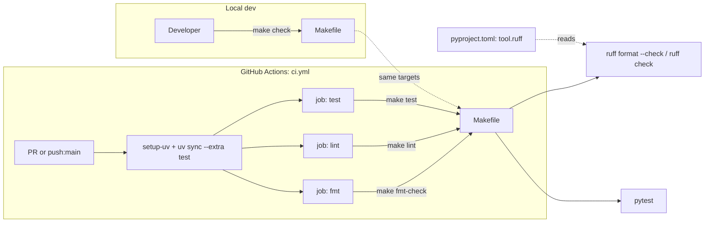

# Design — `add-ci`

## Overview

Three artifacts, one source of truth:

1. **`Makefile`** — the canonical definition of `fmt`, `fmt-check`, `lint`, `test`, `check`, `install`.
2. **`pyproject.toml` `[tool.ruff]`** — formatter and linter configuration; same config used locally and in CI.
3. **`.github/workflows/ci.yml`** — three parallel jobs (`fmt`, `lint`, `test`) that each call into the Makefile.

The Makefile is intentionally thin (one command per target) so CI is auditable: anyone reading `ci.yml` can map a step to a Makefile target and reproduce it locally with one command.

### Pre-implementation reality check (informs design choices below)

I ran the proposed checks against the current codebase before writing this design:

```
ruff check --select E,F,W,I scripts/ tests/   →  575 errors
ruff format --check scripts/ tests/           →  43 files would reformat
```

Lint breakdown and plan:

| Rule | Count | Auto-fix? | Plan |
|---|---:|---|---|
| E501 line-too-long | 470 | no | `line-length = 120` plus **ignore E501 globally** — `ruff format` already wraps wherever it can; remaining long lines are unwrappable strings |
| F401 unused-import | 32 | yes | `ruff check --fix` |
| I001 unsorted-imports | 26 | yes | `ruff check --fix` (also covered by `ruff format`) |
| E701/E702 multi-statement-line | 27 | no/yes | Resolved by `ruff format` |
| E402 import-not-at-top | 6 | no | Per-file-ignore — scripts with `sys.path.insert(...)` legitimately import after path setup |
| F841 unused-variable | 6 | no | Manual fix (real bugs worth keeping in lint) |
| E741 ambiguous-variable | 4 | no | **Ignore globally** — bikeshed, not worth the churn |
| F541 f-string-missing-placeholders | 3 | yes | `ruff check --fix` |
| E401 multiple-imports-one-line | 1 | yes | `ruff check --fix` |

After `ruff format` + `ruff check --fix` + `line-length=120` + ignoring `E501,E741` + per-file-ignores for `E402` in scripts/, **the residual cleanup is just the 6 F841 manual fixes**.

## Steering Document Alignment

No steering documents (`product.md`, `tech.md`, `structure.md`) exist for this repo. Decisions are anchored instead in the explicit conventions visible in the codebase: `uv` for dep management, `pyproject.toml` for tool config, scripts in `scripts/`, tests in `tests/`, custom pytest markers for opt-in heavy tests.

## Code Reuse Analysis

There is nothing pre-existing to extend — no Makefile, no `.github/`, no formatter/linter config. All three artifacts are net-new. The single existing convention to honor is **`uv` workspace style** (`uv.lock` is canonical, `uv sync --extra test` already works).

## Architecture



Three jobs run in **parallel** — they're independent and short, so serializing them would only add wall-clock time. Each does its own `setup-uv` + cached `uv sync`; with the cache warm, this is < 10 s of overhead per job.

## Components and Interfaces

### Component 1 — `Makefile` (top-level)

- **Purpose:** Single, authoritative definition of CI checks. Same commands run locally and in CI.
- **Interfaces:** Phony targets — `install`, `fmt`, `fmt-check`, `lint`, `test`, `check`, `help`.
- **Dependencies:** `uv` on PATH; `pyproject.toml` and `uv.lock` present at the repo root.
- **Reuses:** Nothing — net-new file.

```makefile
# Targets:
#   install     - sync deps with the test extra
#   fmt         - apply formatting in-place (local convenience)
#   fmt-check   - verify formatting, fail if anything would change (CI)
#   lint        - run ruff check
#   test        - run pytest
#   check       - run all three CI checks (fmt-check, lint, test)
#   help        - print this list

.PHONY: install fmt fmt-check lint test check help
.DEFAULT_GOAL := help

UV ?= uv
RUFF := $(UV) run --extra test ruff
PYTEST := $(UV) run --extra test pytest

install:
	$(UV) sync --extra test

fmt:
	$(RUFF) format scripts/ tests/
	$(RUFF) check --fix --select I scripts/ tests/

fmt-check:
	$(RUFF) format --check scripts/ tests/

lint:
	$(RUFF) check scripts/ tests/

test:
	$(PYTEST)

check: fmt-check lint test

help:
	@grep -E '^# {3}[a-z]' Makefile | sed 's/^# *//'
```

Notes:
- `RUFF`/`PYTEST` go through `uv run --extra test` so `make` works without manually activating a venv. `uv run` is idempotent — if the venv is already synced it's near-instant.
- `fmt` also runs `ruff check --fix --select I` so import-sorting fixes get applied alongside formatting (Ruff's formatter doesn't sort imports by itself; the `I` rule does).
- `fmt-check` only checks formatting, not lint — lint has its own job. This keeps the failure signals separable.

### Component 2 — `pyproject.toml` `[tool.ruff]` block

- **Purpose:** Shared formatter + linter configuration.
- **Interfaces:** Read by Ruff CLI automatically when run from the repo root.
- **Dependencies:** Ruff ≥ 0.5 (stable formatter API).
- **Reuses:** Adds new sections to existing `pyproject.toml`; doesn't touch existing `[tool.pytest.ini_options]`.

```toml
[tool.ruff]
line-length = 120
target-version = "py310"
extend-exclude = [
    ".venv",
    "01_data",
    "02_logs",
    "03_notion_drafts",
    "00_inputs",
    "_index",
    "pytest-cache-files-*",
]

[tool.ruff.lint]
# Ruff defaults (E, F) plus warnings (W) and import sorting (I).
# Justified per-rule choices:
#   E501 (line-too-long): `ruff format` already wraps where it can; the
#       residual long lines are unwrappable strings (Field descriptions,
#       file paths, f-strings) where E501 only adds noise. Standard practice
#       when running `ruff format`.
#   E741 (ambiguous names: `l`, `I`, `O`) is too noisy for research code.
select = ["E", "F", "W", "I"]
ignore = ["E501", "E741"]

[tool.ruff.lint.per-file-ignores]
# Scripts that mutate sys.path before importing — legitimate in standalone
# CLI scripts that need to import sibling modules.
"scripts/*.py" = ["E402"]
# Tests sometimes leave debug imports around briefly during development;
# we still want F401 enforcement, but allow `from x import *` style imports
# in conftest if needed.
# (Empty placeholder — add only if a real case appears.)

[tool.ruff.format]
# Defaults are fine — double quotes, trailing commas where allowed, etc.
```

And in the existing `[project.optional-dependencies].test` block, add Ruff so it's resolved into `uv.lock` and pinned for everyone:

```toml
test = [
    "pytest>=8",
    "ruff>=0.5,<1.0",
]
```

### Component 3 — `.github/workflows/ci.yml`

- **Purpose:** Run `make fmt-check`, `make lint`, `make test` on every PR and `main` push.
- **Interfaces:** GitHub Actions YAML schema; provides three named status checks: `fmt`, `lint`, `test`.
- **Dependencies:** `astral-sh/setup-uv@v8`, `actions/checkout@v4`.
- **Reuses:** Nothing — net-new.

```yaml
name: CI

on:
  pull_request:
    branches: [main]
  push:
    branches: [main]

# Cancel superseded runs on the same PR/branch to save CI minutes.
concurrency:
  group: ${{ github.workflow }}-${{ github.ref }}
  cancel-in-progress: ${{ github.event_name == 'pull_request' }}

jobs:
  fmt:
    name: fmt
    runs-on: ubuntu-latest
    steps:
      - uses: actions/checkout@v4
      - uses: astral-sh/setup-uv@v8
        with:
          enable-cache: true
      - run: uv sync --extra test
      - run: make fmt-check

  lint:
    name: lint
    runs-on: ubuntu-latest
    steps:
      - uses: actions/checkout@v4
      - uses: astral-sh/setup-uv@v8
        with:
          enable-cache: true
      - run: uv sync --extra test
      - run: make lint

  test:
    name: test
    runs-on: ubuntu-latest
    steps:
      - uses: actions/checkout@v4
      - uses: astral-sh/setup-uv@v8
        with:
          enable-cache: true
          python-version: "3.10"
      - run: uv sync --extra test
      - run: make test
```

Design choices in the workflow:

- **Three jobs, not one job with three steps.** Reasons: (a) parallel execution, (b) failures stay isolated (one red check shows exactly which gate broke), (c) you can require any subset in branch protection.
- **`setup-uv@v8` with `enable-cache: true`.** Caches the `uv` global download cache. The action's default `cache-dependency-glob` (covers `uv.lock`, `pyproject.toml`, `requirements*.txt`, `*.py.lock`) is correct for this repo, so we don't override it — that way a `pyproject.toml` change correctly invalidates the cache. Cold install ~30 s, warm ~5 s.
- **Python pinned only on the `test` job.** Pinning to 3.10 ensures we test on the floor version. `fmt`/`lint` don't execute Python code, so they don't need a specific interpreter version.
- **`concurrency` block cancels stale PR runs** when a new commit is pushed to the same branch. Saves CI time without affecting correctness.
- **No matrix.** Per requirements non-goals.
- **R1.3 path filters intentionally deferred.** Requirement 1.3 allowed (but did not require) skipping the workflow when no relevant files change. Skipping it for v1 — the workflow is fast enough that the `paths:` filter complexity isn't worth the risk of accidentally letting an unguarded change slip through.

## Data Models

None. CI is a stateless verification pipeline.

## Error Handling

| Scenario | Where it surfaces | How |
|---|---|---|
| Format drift | `fmt` job | `ruff format --check` exits non-zero, prints reformatted-file list |
| Lint violation | `lint` job | `ruff check` exits non-zero, prints rule + location |
| Test failure | `test` job | `pytest` exits non-zero with traceback in log |
| `uv.lock` out of sync with `pyproject.toml` | all jobs (in `uv sync` step) | `uv sync` errors before `make` runs — clear "lockfile out of date" message |
| Missing optional extras (e.g. `semantic`, `indexing`) | `test` job | Tests using those imports either are skipped (markers) or fail fast — both visible. We install only `--extra test` per requirements; if a test bombs because it required `semantic`, that's a real bug to surface. |
| Network unavailable during `uv sync` | all jobs | `setup-uv` cache hit avoids network on warm runs; cold misses fail with `uv` network error — retry the workflow |
| Ruff version drift | all jobs | Ruff is installed via `uv sync` from the resolved `uv.lock` — pinned. We add Ruff to `[project.optional-dependencies].test` so it's locked. |

## Testing Strategy

CI itself doesn't ship application code, but its correctness still needs to be verified.

### Verification of the workflow itself

1. **Pre-merge dry run (local).** Before the workflow file is committed, run `make check` locally. All three subcommands must pass.
2. **First PR is the workflow PR.** The PR introducing this spec's artifacts will itself be the first run of the workflow. We expect: green `fmt`, green `lint`, green `test`. If any job fails on its own introducing PR, that's the signal to fix the spec's cleanup task before merging.
3. **Negative-path smoke test (post-merge, optional).** Open a throwaway branch with a single deliberately-bad change (e.g. an unused import) and confirm CI catches it. Not required for spec completion; a 30-second sanity check.

### What is not tested by CI

- Tests requiring `01_data/index/` (marked `needs_index`) — they skip cleanly.
- Tests requiring `embeddings.npy` (marked `needs_embeddings`) — they skip cleanly.
- The `indexing`, `semantic`, `rerank` optional extras are not installed in CI. Pure-pytest unit tests in `tests/` don't need them; the existing tests already gate on artifact presence.

### Performance target

Total wall-clock for a warm-cache PR run: **< 90 s** (well inside the 3 min budget from requirements). Cold cache: ~3 min.

## Implementation Order (informs the tasks doc)

1. Add `[tool.ruff]` config to `pyproject.toml` (no behavior yet — just config).
2. Add Ruff to the `test` extra in `pyproject.toml` so it's resolved into `uv.lock`.
3. Run a one-time cleanup pass: `ruff format` → `ruff check --fix` → manual fixes for the residual ~30 issues. Commit as a separate prep commit; CI does not need to be in place yet.
4. Add the `Makefile`.
5. Verify `make check` passes locally.
6. Add `.github/workflows/ci.yml`.
7. Open the PR; confirm all three checks go green; merge.
8. (User action, post-merge) Add `fmt`, `lint`, `test` to required status checks in branch protection.

## Open Risks

- **`uv sync --extra test` on stock `ubuntu-latest`** has not been verified in this environment yet; I have high confidence this works (project already uses `uv` locally, `setup-uv@v3` is the official action) but the first CI run is the proof.
- **Residual lint count after auto-fix** — my estimate is ~30 manual fixes. If the actual number is meaningfully larger after running the auto-fixers, we should split it into its own PR rather than bundle with the CI workflow.
- **Ruff version pinning vs floating** — pinning to `>=0.5,<1.0` in the test extra balances stability with picking up bugfixes; if Ruff tightens defaults in a minor release we may see new violations. Acceptable given the small blast radius.
