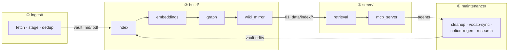

# Architecture & Design

This document is the **narrative layer** for the repo. The [`README.md`](README.md) already
covers *how to use it* (setup, template quick start, folder layout) and is not repeated here.
(Maintainers working in-tree also have a local `CLAUDE.md` — the agent contract for changes that
cross into a specific vault; it's not part of the public tree because it's tied to one operator's
paths.)

What the README doesn't tell is the connected story: **why the system is shaped this way**, the
handful of principles that generate all the specific rules, and how the whole thing relates to
the idea that inspired it. That's this doc.

---

## 1. What this is

`llm-wiki-rag` is a **schema-driven, topic-agnostic toolchain** for building and maintaining a
wiki that an LLM owns. Sources are ingested into a Markdown (Obsidian-compatible) vault; the
vault is compiled into a chunked hybrid-retrieval index; the index is served to agents over MCP.

The defining stance: **this repo is machinery, not content.** It ships no vault — you bring your
own via `WIKI_VAULT`, and everything domain-specific lives in one file, `wiki_schema.yml`. For
setup, follow the [README](README.md#using-this-template); the rest of this doc assumes you know
what the pipeline *does* and explains how it's *built*.

---

## 2. Origin & positioning

The north star is Andrej Karpathy's ["LLM-maintained wiki"](https://gist.github.com/karpathy/442a6bf555914893e9891c11519de94f)
pattern: rather than re-deriving answers from raw sources on every query (classic RAG), an LLM
**synthesizes knowledge once into a persistent, compounding artifact** and keeps it current. The
gist prescribes three layers — **raw sources → wiki → schema** — and three operations —
**ingest / query / lint**. This repo is one faithful implementation of that pattern.

Three stances make this repo distinctive as an implementation of that pattern:

1. **Topic-agnostic template ("cartridge system").** `wiki_schema.yml` is a swappable cartridge
   that re-themes the entire pipeline — including the MCP tool prose and server name — with no
   Python edits. The pipeline was built for an AI-safety wiki but already runs a second instance
   (an LLM-philosophy wiki) off nothing but a different schema.
2. **Retrieval quality as the focus.** A real hybrid stack — BM25 + dense embeddings, RRF fusion,
   and a cross-encoder rerank — degrading gracefully to BM25 when embeddings aren't built.
3. **Agent-first, contract-driven.** A frozen CLI facade, a frozen MCP surface, and vault-side
   PROCESS docs, all enforced by strict validation and meta-tests. It's built to be *operated by
   an LLM under contract*, not clicked by a human.

Karpathy's pattern also envisions a knowledge-graph layer (visualization, surfacing surprising
connections and gaps). For a long time this repo didn't attempt that half — relevance came from
rerank, not from a graph. The graph layer landed 2026-07-10: a file-relatedness graph
(`01_data/index/graph.json`) built from shared vocabulary, wikilink citations, and embedding
similarity, exposed via `find_related_files` / `graph_insights` and an optional retrieval-time
expansion signal (see §4 Retrieval design and MCP surface).

---

## 3. The design principles (the "why" layer)

The repo enforces a set of cross-folder contracts — invariants between this code and the vault it
maintains. They're not arbitrary: almost every one is an **instance of a smaller set of
principles**. Those principles are the connective tissue, and they're what this section makes
explicit.

**1. Single source of truth, mechanically enforced.**
Every fact lives in exactly one place; everything else derives from it — vocabulary (schema →
generated vault block), meta-doc list (one list + one predicate), manifest columns
(schema-derived names *and* values), path resolution (`locations.py`), tuning knobs
(`config.yml`). The failure mode being designed against is *drift between two hand-maintained
copies*. The fix pattern is always the same: pick one canonical home, make the other a generated
artifact or a thin compatibility alias.

**2. Schema-driven everything.**
The code is topic-agnostic; all domain knowledge is data in `wiki_schema.yml`. Adding a field,
concept, tag, or risk category — or changing the wiki's identity or vault default — requires no
Python. The MCP server name, manifest header, meta-doc predicate, and vocab lookups all follow on
next process start. The single deliberate exception: adding a new field *type* (extending
`FieldSpec.type`'s Literal) needs a Python edit, because a Literal can't teach Pydantic to
validate a new shape. This is the deepest principle — the repo is the machinery, the schema is
the cartridge.

**3. Strict validation, fail loud at startup.**
Both YAMLs and all MCP inputs are frozen Pydantic models with `extra="forbid"` + `strict=True`
and **no fallback to Python defaults**. Typos, unknown keys, missing keys, and coerced types fail
at first call rather than silently corrupting the index. Rationale: an LLM maintainer *will* make
key-name and type mistakes; the system makes them loud and immediate instead of latent.

**4. Two orthogonal separation axes.**
- *Machinery here vs. content there* — this repo ships no vault; the vault is the product, the
  repo is the toolchain. A fresh clone is deliberately missing the vault, the URL seed list, and
  all build artifacts (all regenerable or BYO).
- *Tuning vs. domain* — `config.yml` holds mechanical knobs (chunk sizes, BM25 params, model
  names, timeouts); `wiki_schema.yml` holds what-the-wiki-is-about (fields, vocab, identity).
  Two files precisely so they're never conflated.

**5. Non-destructive by default.**
`_trash/<date>/` over `rm` (behind a user-confirmation gate); most scripts are dry-run /
report-only with mutation gated behind `--apply`; the one unconditional writer (`notion-regen`)
takes a timestamped backup first. An LLM operating on a curated corpus should never be one bad
pass away from irreversible loss.

**6. Ephemerality discipline for one-shots.**
Bulk-migration scripts run once and are then *deleted from the tree* (recoverable via git), never
left as tracked code. Convention: `scripts/_oneshot_<purpose>_<date>.py`, then `git rm` before
commit; reusable logic graduates to `wiki_lib/`.

**7. Dual contract surface: CLI vs. MCP.**
The same retrieval logic is exposed two ways for two audiences. **MCP** (`serve/mcp_*`) is the
interactive/agent contract; the **`scripts.cli` facade** is the frozen shell contract for vault
PROCESS docs and scheduled tasks. Internal module moves are free; renaming a facade command or an
MCP tool is a breaking change requiring a same-session doc sweep. Both are guarded by meta-tests.

---

## 4. Architecture & data flow

Five stages, wired through one frozen CLI facade (`scripts/cli.py`) and backed by three
single-source-of-truth config layers: `config.yml` (tuning), `wiki_schema.yml` (domain), and
`scripts/wiki_lib/locations.py` (paths).

### Stages, entry points, and artifacts

| Stage | Entry module(s) | Reads | Writes |
|---|---|---|---|
| Ingest (bulk) | `ingest/fetch.py` | `00_inputs/urls_dedup.csv` | vault `Sources/_inbox/*`, `02_logs/fetch_log.csv` |
| Ingest (single/recurring) | `ingest/stage_candidate.py` | one URL (or `--content-file`) | vault `_add_by_me/*` (index-excluded) |
| Dedup (report only) | `ingest/dedup_report.py` | vault `.md` frontmatter | `02_logs/dedup_report.csv` |
| Build / index | `build/index.py` | vault `.md`/`.pdf`, `.cache/` | `01_data/index/{index.json, chunks.jsonl, manifest.csv}` |
| Embed | `build/embeddings.py` | `chunks.jsonl` | `01_data/index/embeddings.{npy,_ids.json,_meta.json}` |
| Graph | `build/graph.py` | `chunks.jsonl` + embeddings | `01_data/index/graph.json` (neighbors, Louvain communities, insights) |
| Mirror | `build/wiki_mirror.py` | `manifest.csv` | vault `_index/{README, by_category, by_concept, by_tag}` |
| Serve | `serve/mcp_server.py` (+ `retrieval.py`) | index artifacts | JSON responses; `source_state.json` on rebuild |
| Maintain | `maintenance/*` | vault + `01_data/notion_sources.csv` | `notion_sources.csv`, `02_logs/*` |
| Research loop | `maintenance/research_loop.py` | vault `open_questions.md` + index artifacts | marker-safe vault edits (staged candidates, briefs) |

`embed` is incremental by default: chunk identity is `sha1(chunk_text)`, cached vectors are reused
for unchanged chunks, and the model only loads when there is new text to encode. `build` (and the
MCP `rebuild_index`) auto-run the embeddings refresh and then `graph` at the end of every
successful full build; `rebuild_index` reports both in its payload (`embeddings` / `mirror` blocks).

The **CLI facade** (`scripts/cli.py:21`, the `COMMANDS` table) is the frozen shell entry point:
`build, mirror, embed, graph, query, serve, fetch, stage, dedup, cleanup, vocab-sync, research,
notion-regen, vault-init`. Internal modules move freely as long as this table keeps pointing at them.

### Index artifacts (`01_data/index/`)

- `index.json` — corpus header (`vault, built_at, n_files, n_chunks, n_tokens`) + per-file metadata (no chunk text).
- `chunks.jsonl` — one chunk per line: `file_id, chunk_id, relpath, title, category, tags[], concepts[], heading_path, tokens, text`. The `tags`/`concepts` keys are a **frozen retrieval contract**.
- `manifest.csv` — flat per-file table; 17 columns = 8 fixed build-stat + schema `frontmatter.fields` (in declared order) + `relpath`. Renaming a schema field renames its column *and* keeps it populated.
- `embeddings.npy` (n×384 float32) + `embeddings_ids.json` + `embeddings_meta.json`.
- `graph.json` — file-relatedness graph (neighbors, communities, insights).
- `source_state.json` — the rebuild-debounce fingerprint (written only by the MCP `rebuild_index`, not by CLI builds).

### Retrieval design

All in `scripts/serve/retrieval.py`; tuning constants come from `config.yml → retrieval:`.

- **Lexical** — `bm25_search`: BM25 (`k1=1.5`, `b=0.75`) with title/heading boosts.
- **Dense** — `semantic_search`: cosine over `embeddings.npy`, query-embedded with SentenceTransformer `BAAI/bge-small-en-v1.5`.
- **Fusion** — `_rrf`: Reciprocal Rank Fusion (`k=60`), each retriever oversampled before merge.
- **Rerank** — `rerank`: CrossEncoder `ms-marco-MiniLM-L-6-v2` over the top candidates.
- **Orchestrator** — `search(...)`: `mode ∈ {bm25, semantic, hybrid}`. Hybrid oversamples both retrievers, RRF-merges, then optionally reranks — and **degrades gracefully to BM25** when embeddings aren't built and to unranked results when the `rerank` extra isn't installed.
- **Graph expansion** — post-RRF neighbor injection, rerank-gated (config `retrieval.graph_expansion`; surfaced as the `expand_graph` kwarg on `search_wiki`/`multi_query_search`, forwarded per-paraphrase). Enabled in the shipped config since 2026-07-10; template adopters should start with `enabled: false` and A/B against their own corpus first.

### MCP surface

The server is split three ways so the tool surface stays a stable import point:

- `serve/mcp_app.py` — the FastMCP `mcp` singleton (`:71`), the server-name derivation, and the canonical error envelope + `_wrap_errors` decorator (`:37`).
- `serve/mcp_tools/{search,browse,write,admin}.py` — the 14 tool implementations, grouped by concern (`browse.py` now also carries `find_related_files` / `graph_insights`).
- `serve/mcp_server.py` — the runnable entrypoint; re-exports the whole surface.

Every tool returns a JSON string; every failure path returns the same envelope,
`{"ok": false, "error": "<code>", "detail": "<msg>"}`. All input models are `extra="forbid"`, so
unexpected kwargs are rejected at runtime. Tool descriptions are templated from `wiki_schema.yml`,
so a schema swap relabels the surface without code edits.

### `wiki_lib/` — the single-source-of-truth helpers

| Module | Role |
|---|---|
| `config.py` | Frozen tuning model from `config.yml` (`get_config()`) |
| `schema.py` | Frozen domain model from `wiki_schema.yml` (`get_schema()`, `mcp_server_name()`) |
| `locations.py` | The *only* answer to "where is the vault / repo?" (`vault_path()`, `work_path()`) |
| `paths.py` | The *one* predicate `is_indexable_path()` + `meta_doc_basenames()` — shared by build and retrieval |
| `fields.py` | Schema-driven frontmatter/CSV field extraction (alias-aware, type-coerced) |
| `frontmatter.py` | Canonical `---` YAML reader/writer; handles both inline-flow and block-list forms |
| `source_state.py` | Fingerprint helpers for rebuild debouncing |

---

## 5. The April-2026 refactor (origin story)

Today's clean phase-package layout (`ingest/ build/ serve/ maintenance/ wiki_lib/`) is not how the
repo started. A code audit at the end of April 2026 diagnosed a `scripts/` folder holding three
tangled populations — pipeline modules, one-shot migration scripts, and shared helpers — with the
same logic forked across many copies (frontmatter parsing had been independently reimplemented
about a dozen times). The audit prescribed extracting a shared `wiki_lib/`, reorganizing by phase,
and adding a test plan.

That blueprint became today's structure — and then went further than the audit imagined. The
audit still had vocabulary and path resolution as Python literals; the post-audit additions
(`schema.py`, `config.py`, `locations.py`, `fields.py`, `source_state.py`) pushed the
single-source-of-truth principle (§3.1) all the way down, so that domain, tuning, and paths each
have exactly one home.

The audit doc itself (`CODE_AUDIT_2026-04-30.md`) is now a local-only working file (gitignored;
recoverable via `git show 38ce8f3:CODE_AUDIT_2026-04-30.md`). This section is the durable, tracked
record of *why the code is laid out the way it is* — so the rationale survives even though the
scratch doc isn't shipped.

---

## 6. See also

- **[`README.md`](README.md)** — setup, template quick start, folder layout, reproducibility.
- **[`scripts/README.md`](scripts/README.md)** — operational how-to for the bulk fetcher.
- **`CLAUDE.md`** (local, in-tree, not published) — the maintainer's agent contract: the cross-folder invariants with `file:line` citations and default behaviors. Present only in an operator's working copy, since it's tied to a specific vault location.
- **Vault-side `PROCESS_*.md`** — the user-facing operational workflows (ingest / query / health-check) that agents follow; rendered into the vault by `cli vault-init`.
