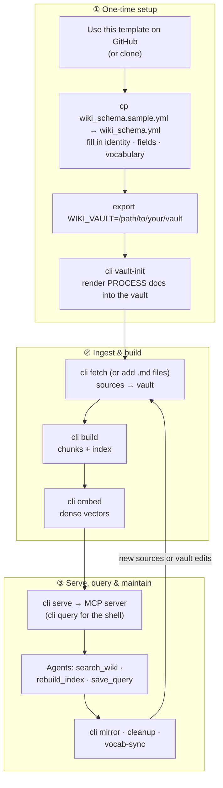

<div align="center">

# LLM Wiki RAG

[](https://github.com/wuharlem/llm-wiki-rag/actions/workflows/ci.yml)
[](LICENSE)

[](https://docs.astral.sh/uv/)


**Build-and-maintenance pipeline for an LLM-maintained wiki** — ingest sources into a Markdown (Obsidian-compatible) vault, build a chunked hybrid-retrieval index (BM25 + dense + rerank), and serve it to agents over MCP. Topic-agnostic: everything domain-specific lives in one file, `wiki_schema.yml`.

[Quick Start](#using-this-template) · [Create Your Own Wiki](#creating-your-own-wiki-on-a-different-topic) · [Pipeline Stages](#pipeline-stages) · [Folder Layout](#folder-layout) · [Reproducibility](#reproducibility-read-this-first) · [Architecture](ARCHITECTURE.md)

</div>

> **This repo is the machinery, not a wiki.** It ships no vault content — bring your own via `WIKI_VAULT`. The schema shipped here is the AI-safety wiki the pipeline was built for, kept as a filled-in worked example; `wiki_schema.sample.yml` is the blank starting point.
>
> New to the design? [`ARCHITECTURE.md`](ARCHITECTURE.md) is the narrative layer — why the system is shaped this way, how it relates to Karpathy's "LLM-maintained wiki" pattern, and the end-to-end data flow.

## Using this template



_`cli <cmd>` is shorthand for `uv run python -m scripts.cli <cmd>`. The numbered steps below are the authoritative quick start._

**Requires Python 3.10+** (see `requires-python` in `pyproject.toml`). [`uv`](https://docs.astral.sh/uv/) manages the interpreter and dependencies — `uv run` provisions a matching Python automatically, so no manual virtualenv is needed.

1. Click **Use this template** on GitHub (or clone the repo).
2. `cp wiki_schema.sample.yml wiki_schema.yml` and fill in your domain — identity, frontmatter fields, vocabulary, vault location. Details in "Creating your own wiki on a different topic" below.
3. Point the pipeline at your vault: `export WIKI_VAULT=/path/to/your/vault` (or edit `vault.default_relpath` in the schema).
4. `uv run python -m scripts.cli vault-init` — renders the vault's operational PROCESS docs (ingest / query / health-check workflows) from `templates/vault/`, with the vocabulary section generated from your `wiki_schema.yml`.
5. `uv run python -m scripts.cli build`, then `uv run python -m scripts.cli serve`.

**Your vault can start empty.** `vault-init` scaffolds the operational docs into it; there's no need for pre-existing content. Add sources before the first `build` either with `cli fetch` (from a URL seed list) or by dropping Markdown files into the vault yourself. `build` and `serve` run fine against an empty vault, but retrieval stays empty until the vault has indexable pages.

## Reproducibility (read this first)

**This repo is the machinery, not a wiki.** It contains no vault content. A fresh clone is missing:

- **A vault** — the Markdown pages, PDFs, and frontmatter the pipeline indexes. The vault is the product; this repo is the toolchain that maintains it. Bring your own via `WIKI_VAULT`.
- **A URL seed list** (`00_inputs/urls_dedup.csv` and siblings, gitignored) — Stage 1 (`fetch.py`) reads this file; without it there is nothing to fetch.
- **All build artifacts** (`01_data/index/*`, `02_logs/`, `03_notion_drafts/`) — regenerated by the pipeline given a vault.

What you _can_ do with a bare clone: read the scripts, run the unit tests (integration tests marked `needs_index` skip without a built index), and — given your own vault and schema — build and serve a wiki on any topic.

## Creating your own wiki on a different topic

The pipeline is topic-agnostic. All domain-specific choices live in one file: `wiki_schema.yml` at the repo root. To point the same code at a different topic:

1. **Start from the sample.** `cp wiki_schema.sample.yml wiki_schema.yml`, then edit in place. (The repo's tracked `wiki_schema.yml` is a complete worked example; git history preserves it.)
2. **Change identity.** Set `wiki.name` (human-readable) and `wiki.slug` (kebab-case). The slug becomes the MCP server name via `{slug.replace('-', '_')}_wiki_mcp`, so `slug: "ml-papers"` registers as `ml_papers_wiki_mcp`.
3. **Redeclare frontmatter fields.** Under `frontmatter.fields`, list the fields your Markdown will use, in the order they should appear as `manifest.csv` columns. Field types:
   - `concept_list` — draws from `vocabulary.concepts`
   - `categorical_list` — draws from `vocabulary.categorical_axes.<axis>` (specify `vocab_key:` on the field)
   - `tag_list` — draws from `vocabulary.tags`
   - `enum` — closed set of scalars (specify `values:`)
   - `string`, `date_string`, `url` — free-form scalars with light shape validation

   Each field also accepts optional `aliases:` (alternate frontmatter keys), `derived: true`
   (pipeline-computed), `label:` (display name on generated pages), and `pdf_default:` — see
   `wiki_schema.sample.yml` for details. Renaming a field renames its manifest column and all
   generated output; no Python edits needed.
4. **Fill vocabulary.** For each vocab section (`concepts`, `tags`, `categorical_axes.<axis>`), keys are the canonical names, values are lists of trigger phrases used by the heuristic classifier.
5. **Set the vault path.** Either export `WIKI_VAULT=/path/to/your/vault` or edit `vault.default_relpath` (joined onto `Path.home()`).
6. **Run the pipeline.** `uv run python -m scripts.cli build`, then `uv run python -m scripts.cli serve`.

The schema loader validates strictly (Pydantic `extra="forbid"`, `strict=True`) — typos, unknown keys, and coerced types fail loudly at startup rather than corrupting the index.

### Bootstrapping your vault's process docs

The pipeline assumes the vault carries three operational docs (`PROCESS_NEW_FILE.md`,
`PROCESS_QUERY.md`, `PROCESS_HEALTH_CHECK.md`) plus an orientation map (`_PROCESS_MAP.md`) —
they are the workflow contract agents follow when ingesting, querying, and auditing. Render
them with:

```bash
uv run python -m scripts.cli vault-init
```

- Existing vault files are never overwritten (pass `--force` to re-render).
- The vocabulary section of `PROCESS_NEW_FILE.md` is a **generated block** sourced from
  `wiki_schema.yml`. After changing concepts/tags/axes in the schema, resync it with
  `uv run python -m scripts.cli vault-init --refresh-vocab` — `vocab-sync` lints that the two
  never drift.
- Everything outside the generated block is yours: folder taxonomy, audit checks, and
  house rules accumulate in the vault, not in this repo.

To add a **new field type** beyond the seven built-in literals, edit `scripts/wiki_lib/schema.py::FieldSpec.type` and wire the classifier/manifest emitters in the same commit.

## Folder layout

```text
00_inputs/               # original URL inputs (Obsidian Web Clipper exports)
01_data/                 # canonical data products consumed downstream
02_logs/                 # pipeline logs (one CSV per pass)
03_notion_drafts/        # generated Notion content (per-folder + compact variants)
scripts/                 # all pipeline tooling (Python), split into phase packages:
  ingest/                 #   fetch, dedup_report, stage_candidate
  build/                  #   index, embeddings, wiki_mirror
  serve/                  #   retrieval, query_cli, mcp_app, mcp_server, mcp_tools/
  maintenance/            #   check_vocab_sync, cleanup_metadata, regenerate_notion_sources, vault_init
  wiki_lib/               #   shared helpers (schema, config, paths, locations, ...)
templates/               # vault-init skeletons (rendered into the vault, then owned there)
  vault/                  #   PROCESS_NEW_FILE / PROCESS_QUERY / PROCESS_HEALTH_CHECK / _PROCESS_MAP
README.md                # this file
```

## Pipeline stages

All pipeline commands go through `python -m scripts.cli` (run bare for the command list); the phase-module paths below describe where the code lives.

### Stage 1 — Fetch (network-bound; runs on user's Mac)

```bash
uv run python -m scripts.cli fetch [--sample 3] [--handlers arxiv,pdf,web]
```

Reads `00_inputs/urls_dedup.csv`. Downloads each URL into the vault's `Sources/_inbox/` (arxiv → PDF, web → markdown via trafilatura). Writes `02_logs/fetch_log.csv`. See [scripts/README.md](scripts/README.md) for full setup.

Note: `fetch` imports `requests` and `trafilatura`, which are not uv-managed project dependencies — install them into the environment yourself (`uv pip install requests trafilatura`) before the first fetch.

### Stage 2 — Index and embed

```bash
uv run python -m scripts.cli build
```

Builds `01_data/index/chunks.jsonl`, `01_data/index/index.json`, and the `embeddings.npy` / `_ids.json` / `_meta.json` triple. These are the artifacts the retrieval layer reads.

When the semantic extra is installed (`uv run --extra all ...`), `build` automatically runs both a graph-relatedness pass (producing `01_data/index/graph.json`; file neighbors, communities, insights) and an incremental embeddings refresh (which reuses cached embeddings for unchanged chunks, so the pass is usually ~free). The degraded behavior when the extra is missing is to skip these passes with a note to stderr — the core index artifacts are always built.

For explicit full rebuilds or standalone semantics work, use:

```bash
uv run --extra all python -m scripts.cli embed    # explicit rebuild
uv run python -m scripts.cli graph                 # refresh graph only
```

### Stage 3 — Query

```bash
uv run python -m scripts.cli query "RLHF"   # CLI
uv run python -m scripts.cli serve          # MCP server
```

`query_cli.py` is the local CLI; `mcp_server.py` exposes the same retrieval to MCP-compatible clients (Claude Desktop, Claude Code via the MCP config).

### Stage 4 — Wiki overview rebuild (occasional)

```bash
uv run python -m scripts.cli mirror
```

Regenerates the `_index/` overview pages (one MD per concept). Run after large vault changes.

### Stage 5 — Maintenance tools

`scripts/maintenance/cleanup_metadata.py` is dry-run-by-default; pass `--apply` to mutate. `scripts/ingest/dedup_report.py` is report-only — it writes a CSV and never deletes or modifies anything. `scripts/maintenance/regenerate_notion_sources.py` (`notion-regen`) is different: it REWRITES `01_data/notion_sources.csv` unconditionally, no `--apply` flag, though it takes a timestamped backup first. See each script's `--help` for details.

**Warning:** PDF rows' `url`, `author`, `published`, and `tags` fields exist _only_ in `notion_sources.csv` — they cannot be reconstructed from vault state. If a `notion-regen` run clobbers them, restore from the timestamped backup it wrote before overwriting.

## Historical pipeline (one-shot, April 2026)

The vault was bulk-classified in April 2026 by a one-shot pipeline that performed: manifest extraction, heuristic classification, low-confidence refinement, file renaming, frontmatter audit, vault restructure. Those scripts have been removed from the tree — see `git log --diff-filter=D --since=2026-04-01 --name-only -- scripts/` to recover any of them. The audit at `CODE_AUDIT_2026-04-30.md` documents what each one did.

## Data products

`01_data/` holds the authoritative data:

- **`notion_sources.csv`** — master source list with current vault paths, frontmatter metadata. Regenerate after vault changes.
- **`classifications.csv`** — heuristic classifier output (used to augment PDFs when frontmatter doesn't have wiki_concepts).
- **`classification_manifest.csv`** — file-metadata snapshot used during classification.
- **`by_concept/`** — per-concept slices of `notion_sources.csv` (one CSV per wiki concept). Used as input for Notion concept-article integration.

## Notion drafts

`03_notion_drafts/` holds the generated Notion content for the bulk-ingest source library subpages. Two variants:

- **`per_folder/`** — one entry per file with full metadata (title, type, risk, concepts, tags, file path, source URL, description). Ready to paste into Notion.
- **`per_folder_compact/`** — same data, 2-line compact format. Used for the largest folders, where verbose entries would be too long.
- **`per_folder_compact/chunks/`** — chunked variants of the largest folders (~30 entries per chunk) for Notion API size limits.

## Notes

- Most scripts default to dry-run / report-only modes (pass `--fix` or `--apply` to make changes) — except `notion-regen`, which rewrites `01_data/notion_sources.csv` unconditionally (see Stage 5 above).
- The vault's `PROCESS_NEW_FILE.md` documents the per-file routing taxonomy and the YAML frontmatter contract.
